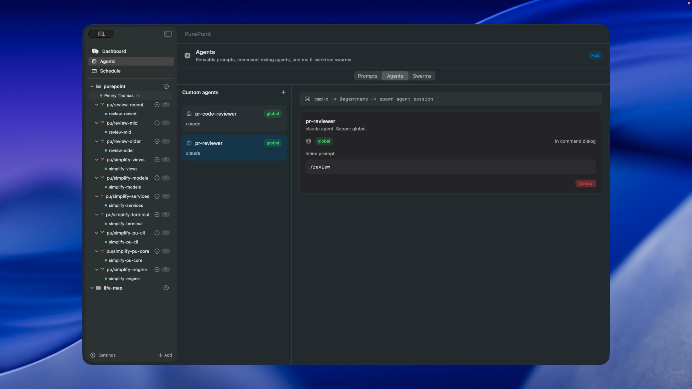
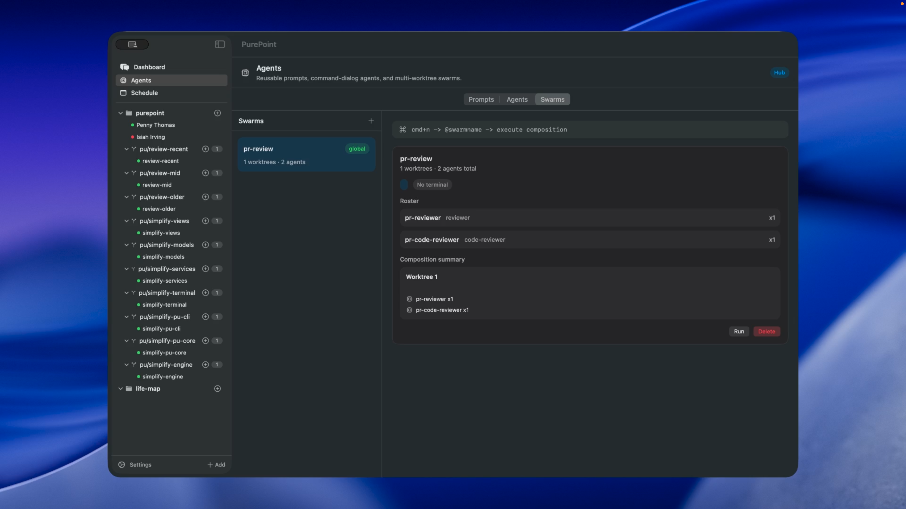
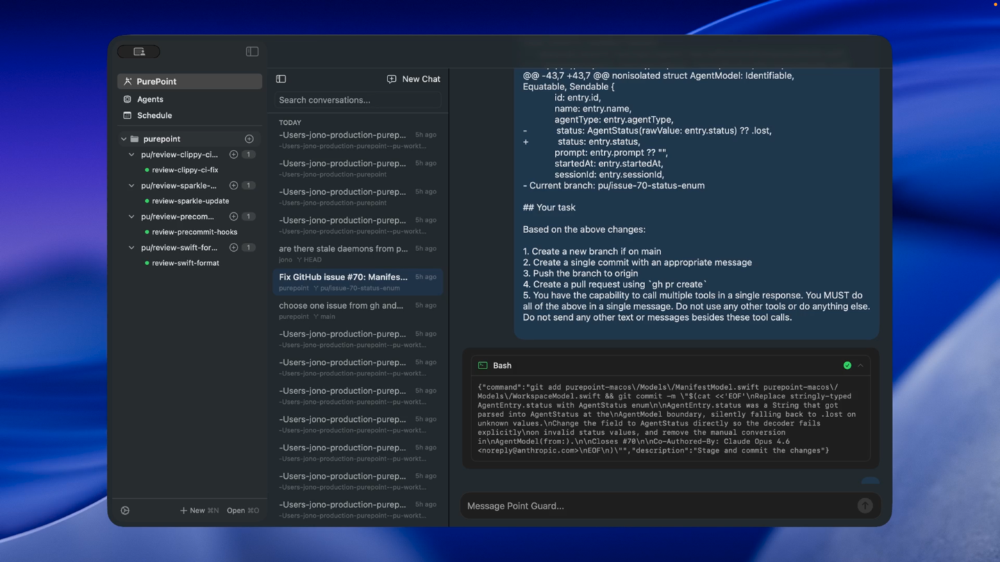
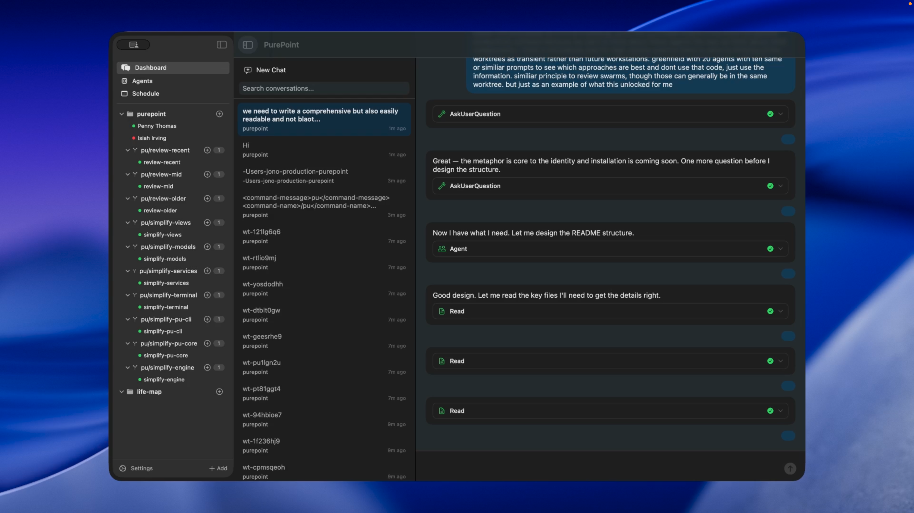
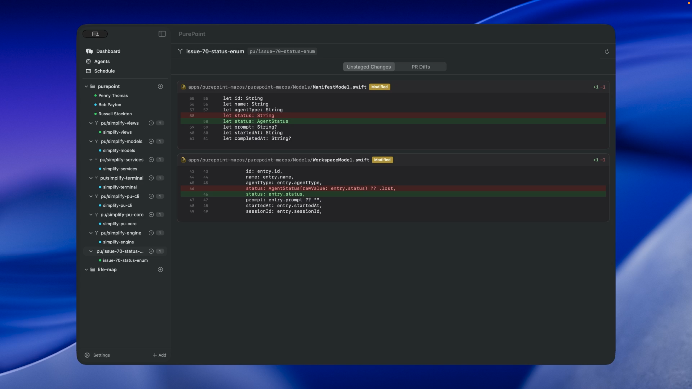
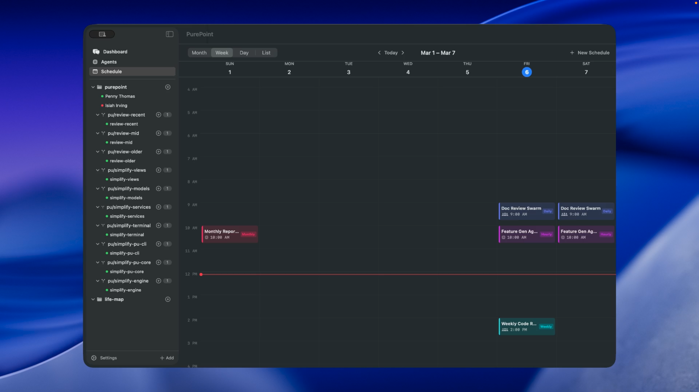
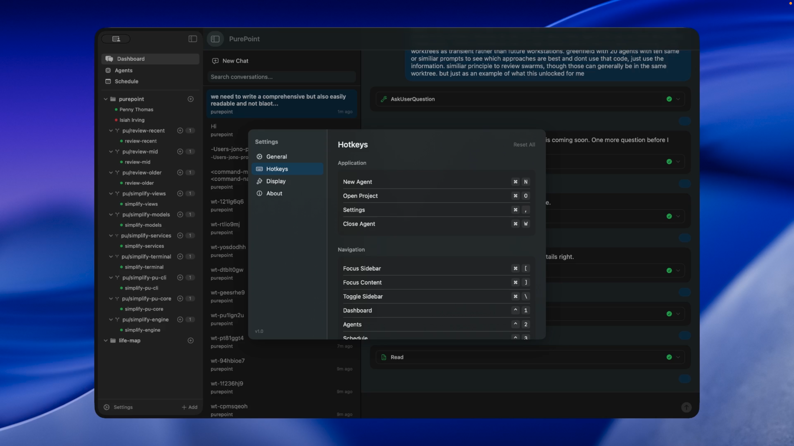

# PurePoint

An agent-first coding workspace.

[](https://github.com/2witstudios/purepoint/actions/workflows/rust.yml)
[](https://github.com/2witstudios/purepoint/actions/workflows/macos.yml)
[](LICENSE)


## The Idea

IDEs were built for humans writing code. PurePoint is built for a world where agents write code and humans direct the work.

In basketball, a pure point guard doesn't score — they read the court, call the play, and put the ball in the right hands. That's the model. You are the point guard. Agents are your players. PurePoint is the court.

Unlike headless agent swarms where you prompt-and-forget, PurePoint gives you workspaces you **coach**. You see every terminal. You step in, redirect, course-correct. The UI is designed like productivity software — think of agents as collaborators, not background jobs.

## Build Your Team

Define reusable agent types — a PR reviewer, a security auditor, a refactorer. Each gets a name, a system prompt, tags, and an agent type (Claude, Codex, or OpenCode). Build your roster once, deploy it everywhere. Definitions can live locally in your project or globally in `~/.pu/`.



The Agents Hub has three tabs — **Prompts** for reusable prompt templates with `{{VARIABLE}}` substitution, **Agents** for named agent definitions with type and tags, and **Swarms** for multi-agent compositions.

## Call the Play

Assemble agents into swarms — named plays. A `pr-review` swarm with 3 reviewers on 1 worktree, or a `simplify` swarm with 7 agents across 7 worktrees. Define the roster, set the execution config, and hit Run.



## Watch the Game

All agents stream live in the sidebar. Click any worktree to watch its terminal. Every agent visible, every branch isolated.

PurePoint has two mental models. **Workstations** are persistent — you spawn agents, direct their work, and work alongside them. Three agents reviewing the same PR from different angles, three panes, three perspectives. **Exploratory swarms** are transient — spawn 20 agents with the same greenfield prompt, let them each take a different approach, then compare results. You use the information, not necessarily the code.

## Split the Screen

Split your workspace into any arrangement of terminal panes — vertical, horizontal, nested. Drag dividers to resize, use keyboard shortcuts to split, close, and navigate. Layouts persist across sessions and restore when you return to a grid.

| Action | Shortcut |
|---|---|
| Split Right | `⌘K ⌘L` |
| Split Below | `⌘K ⌘J` |
| Close Pane | `⌘K Q` |
| Focus Up/Down/Left/Right | `⌘K ↑↓←→` |

## Coach the Players

Point Guard is your conversational interface. Ask it to spawn agents, check status, redirect work — without leaving the chat. Tool calls render inline with expandable details, so you see exactly what's happening.



Conversation history persists across sessions. Resume past conversations, search through them, or start fresh.



## Review the Results

When agents finish, review their work without leaving PurePoint. The diff viewer shows unstaged changes and PR diffs per worktree — modified files highlighted, changes inline with syntax highlighting. PR integration uses `gh` CLI to pull diffs directly from GitHub.



## Clean Up

When you're done with a worktree, clean it up — kill its agents, remove the worktree directory, and delete both the local and remote branches. One command, full cleanup.

```sh
pu clean --worktree wt-abc123    # clean one worktree
pu clean --all                   # clean all worktrees
```

## Schedule the Work

Schedule agents or swarms to run on a cadence. A nightly security review, a weekly dependency audit — results waiting when you open the app. Browse schedules in month, week, day, or list view.

**Recurrence**: one-shot, hourly, daily, weekdays, weekly, monthly. **Triggers**: saved agent definition, swarm, or inline prompt. Schedules can be scoped to a project or set globally.



## Spawn from Anywhere

The command palette (`⌘N`) gives you instant access to all built-in agent types, your custom agent definitions, and saved swarms. Pick one, name the worktree, enter a prompt, and you're running. Fuzzy search narrows the list as you type.

## Make It Yours

Rebind every action. Navigate without a mouse. The settings panel lets you customize hotkeys for all workspace actions and navigation — live key recording, conflict detection, one-click reset to defaults.



## And More

- **Multi-project** — open multiple projects side by side, each with its own agents and worktrees
- **Root agents** — spawn agents in the project root without creating a worktree (`pu spawn --root`)
- **Multiple agents per worktree** — add agents to existing worktrees with `pu spawn --worktree`
- **Agent types** — Claude, Codex, and OpenCode out of the box, plus custom definitions
- **Prompt from file** — pass a markdown file as the agent prompt (`pu spawn --file`)
- **Auto-resume** — agents and layout persist across app restarts; suspended agents can be resumed
- **Local + global scope** — all definitions (prompts, agents, swarms, schedules) can be per-project or global
- **Self-protection** — agents can't kill themselves; `pu kill --all` preserves root agents by default

## Getting Started

Releases coming soon. For now, build from source:

<details>
<summary>Build from source</summary>

Prerequisites: macOS, Rust 1.88+, Xcode, [just](https://github.com/casey/just)

```sh
git clone https://github.com/2witstudios/purepoint.git
cd purepoint
just setup
just build-app
```

</details>

The app installs the `pu` CLI to `~/.pu/bin/pu` on launch. Add it to your PATH:

```sh
export PATH="$HOME/.pu/bin:$PATH"
```

Then in any git project:

```sh
pu init
pu spawn "fix the typo in README"
```

## The `pu` CLI

`pu` is the command-line interface to PurePoint. All commands support `--json` for structured output.

| Command | Description |
|---|---|
| `pu init` | Initialize a PurePoint workspace |
| `pu spawn <prompt>` | Spawn an agent in a new worktree |
| `pu status` | Show workspace status |
| `pu kill` | Kill agents (by agent, worktree, or all) |
| `pu clean` | Remove worktrees, kill agents, delete branches |
| `pu attach <agent>` | Attach to an agent's terminal |
| `pu logs <agent>` | View agent output logs |
| `pu send <agent> <text>` | Send text or keys to an agent's terminal |
| `pu health` | Check daemon health |
| `pu prompt list\|show\|create\|delete` | Manage saved prompt templates |
| `pu agent list\|show\|create\|delete` | Manage saved agent definitions |
| `pu swarm list\|show\|create\|delete\|run` | Manage and run swarm compositions |
| `pu grid show\|split\|close\|focus\|assign` | Control the pane grid layout |
| `pu schedule list\|show\|create\|delete\|enable\|disable` | Manage scheduled tasks |

### Spawn options

```sh
pu spawn "fix the auth bug" --name fix-auth              # worktree + agent
pu spawn "refactor tests" --agent codex                   # use codex instead of claude
pu spawn "review the PR" --worktree wt-existing           # add to existing worktree
pu spawn --root "run the dev server"                      # root agent (no worktree)
pu spawn --root --agent terminal                          # plain terminal
pu spawn --template code-review --var BRANCH=main         # from saved prompt
pu spawn --file path/to/prompt.md --name task1            # from file
```

Run `pu --help` for full usage.

## Current Status

macOS only. Linux TUI is planned.

PurePoint is early and under active development — the core works, but some features are still in design. See [`docs/`](docs/) for specs and architecture.

## Building from Source

<details>
<summary>Development commands</summary>

All tasks use [just](https://github.com/casey/just). Rust 1.88 is pinned via `rust-toolchain.toml`.

```sh
just fmt          # Format Rust code
just lint         # Run clippy lints
just test         # Run all Rust tests
just build-app    # Build the macOS app
just test-app     # Run macOS tests
just ci           # Run everything (fmt-check + lint + test + deny + build-app + test-app)
```

</details>

## License

MIT — [2wit Studios](https://github.com/2witstudios)
