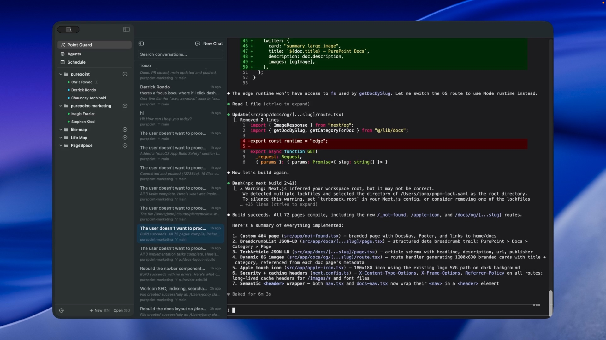
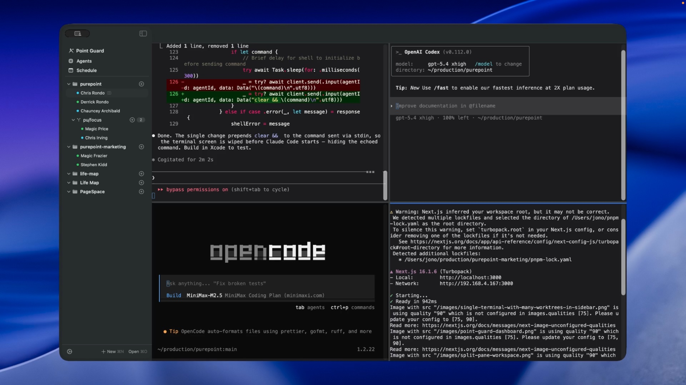
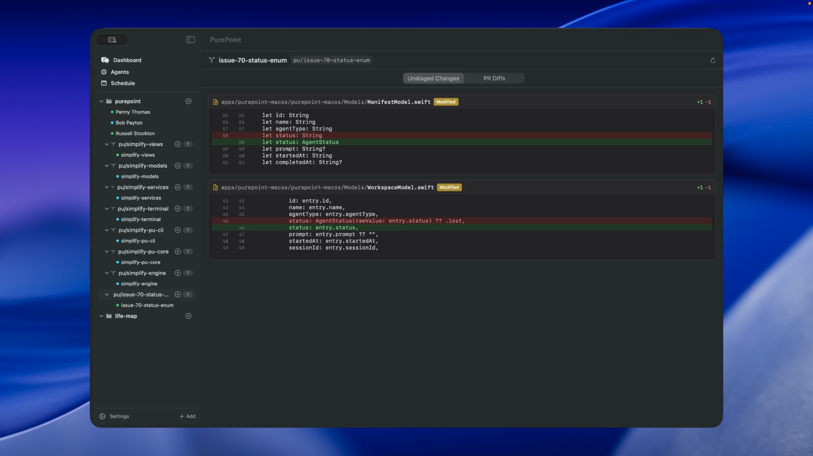
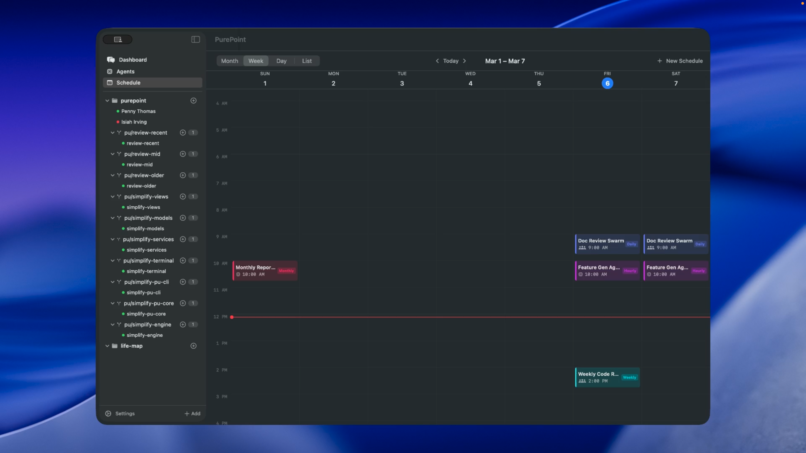
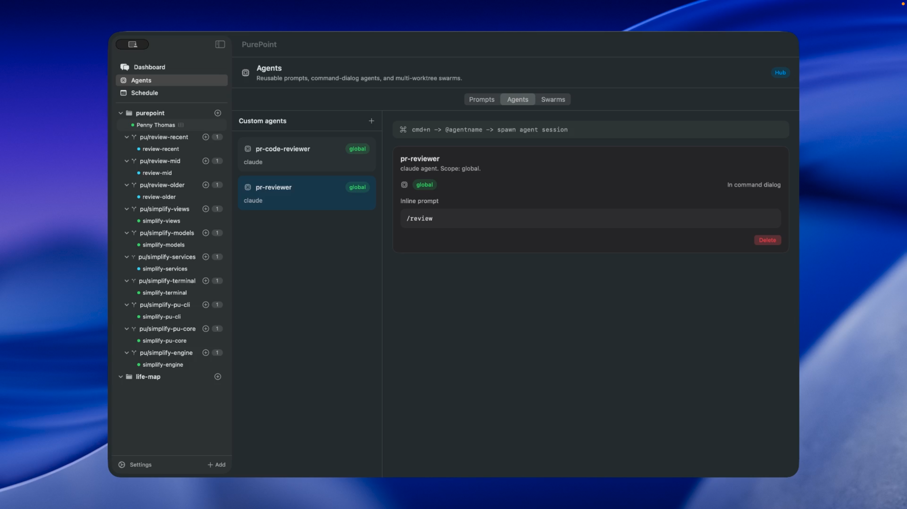
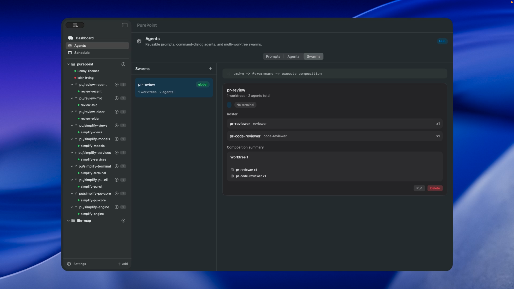
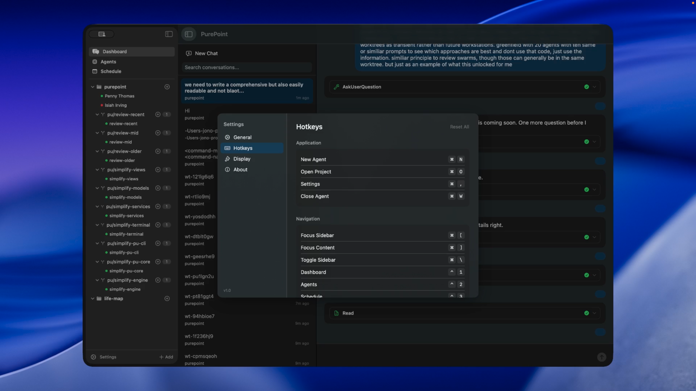

# PurePoint

An agent-first coding workspace for macOS.

[](https://github.com/2witstudios/purepoint/actions/workflows/rust.yml)
[](https://github.com/2witstudios/purepoint/actions/workflows/macos.yml)
[](LICENSE)


Your attention is the bottleneck. Other platforms run headless agents in parallel — you get results, but you can't see the work happening, and you can't step in while it's running. PurePoint gives you a terminal command center for your workspace. Terminals, worktrees, agents — all visible, all yours. You call the plays.

## A terminal that runs the whole offense.

**01 — The Point Guard Screen is your command center.**
A terminal at your home directory where you run Claude Code, Codex, or OpenCode — whichever fits the job. Browse your conversation histories in the sidebar, pick up where you left off, and direct the work from one screen. No black boxes, no vendor lock-in — just a real terminal you control.



**02 — A terminal built for agents.**
Split panes, isolated worktrees, live output — each agent gets its own terminal session. Jump between them, scroll history, pipe input, kill a run. It feels like a real terminal because it is one.



Nothing hits your codebase until you say so.

## See every change as it happens.

Diffs update live as agents work — file by file, worktree by worktree. You always know exactly what's changing. Step in when something looks off, or let it ride.



## Everything else you need.

**Scheduling** — Schedule agents. Wake up to work.



**Custom agents & prompts** — Configure how agents approach your codebase.



**Swarms** — Fan out across many agents at once.



**Hotkeys** — Keyboard-driven everything.



## Getting Started

Three steps. That's it.

1. **Download** the latest `.dmg` from [Releases](https://github.com/2witstudios/purepoint/releases). Drag to Applications.
2. **Add to PATH** — the app installs the `pu` CLI to `~/.pu/bin/` on first launch:
   ```sh
   export PATH="$HOME/.pu/bin:$PATH"
   ```
3. **Init + spawn** — in any git project:
   ```sh
   pu init
   pu spawn "fix the typo in README"
   ```

<details>
<summary>Build from source</summary>

Prerequisites: macOS, Rust 1.88+, Xcode, [just](https://github.com/casey/just)

```sh
git clone https://github.com/2witstudios/purepoint.git
cd purepoint
just setup
just build-app
```

</details>

<details>
<summary><a id="cli"></a>The <code>pu</code> CLI</summary>

All commands support `--json` for structured output.

| Command | Description |
|---|---|
| `pu init` | Initialize a PurePoint workspace |
| `pu spawn <prompt>` | Spawn an agent in a new worktree |
| `pu status` | Show workspace status |
| `pu bench [agent]` | Suspend agents (pull them off the court) |
| `pu play <agent>` | Resume a benched agent |
| `pu kill` | Kill agents (by agent, worktree, or all) |
| `pu clean` | Remove worktrees, kill agents, delete branches |
| `pu attach <agent>` | Attach to an agent's terminal |
| `pu logs <agent>` | View agent output logs |
| `pu send <agent> <text>` | Send text or keys to an agent's terminal |
| `pu health` | Check daemon health |
| `pu pulse` | Workspace pulse — agents, runtimes, git stats |
| `pu diff` | Show git diffs across agent worktrees |
| `pu watch` | Live dashboard showing all agents in real-time |
| `pu prompt list\|show\|create\|delete` | Manage saved prompt templates |
| `pu agent list\|show\|create\|delete` | Manage saved agent definitions |
| `pu swarm list\|show\|create\|delete\|run` | Manage and run swarm compositions |
| `pu grid show\|split\|close\|focus\|assign` | Control the pane grid layout |
| `pu schedule list\|show\|create\|delete\|enable\|disable` | Manage scheduled tasks |
| `pu trigger list\|show\|create\|delete` | Manage event-driven triggers |
| `pu gate <event>` | Evaluate git hook gates |

Run `pu --help` for full usage.

</details>

## Documentation

| | |
|---|---|
| [Getting Started](docs/guide/getting-started.md) | Install, first agent, cleanup |
| [CLI Reference](docs/guide/cli-reference.md) | All commands with examples |
| [Concepts](docs/guide/concepts.md) | Worktrees, agents, swarms, scope |
| [Contributing](CONTRIBUTING.md) | Build, test, code style, architecture |

macOS only. Linux TUI planned. MIT License — [2wit Studios](https://github.com/2witstudios)
